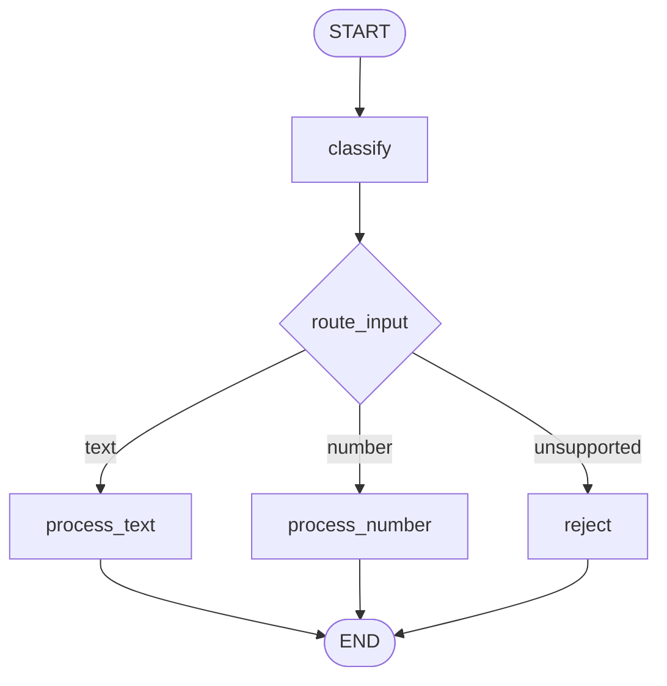

# Lab 03 · Edges and Conditional Routing

> 🕸️ Cơ chế định tuyến có điều kiện (Conditional Routing) và phân phối luồng xử lý dựa trên State.

## 🎯 Mục tiêu

- Áp dụng rẽ nhánh có điều kiện (`add_conditional_edges`).
- Viết hàm Router điều hướng luồng theo trạng thái State.
- Định nghĩa route type chặt chẽ bằng `Literal`.
- Xử lý nhánh fallback cho định dạng không hỗ trợ.

## 🔄 Sơ đồ luồng



## 📂 Cấu trúc & Ý tưởng (DevOps Alert Analyzer)

- **`state.py`**: `RouterState` gồm `input_data`, `input_type`, `processed_result`, `routing_reason`.
- **`nodes/classify.py`**: Nhận diện kiểu dữ liệu đầu vào (text / number / unsupported).
- **`nodes/process_text.py`**: Phân tích từ khóa khẩn cấp trong log.
- **`nodes/process_number.py`**: Tra cứu mã HTTP (200, 404, 500, ...).
- **`nodes/reject.py`**: Thông báo từ chối định dạng lỗi.
- **`routers.py`**: Hàm `route_input` dẫn đường cho đồ thị.
- **`graph.py`**: `StateGraph` + `add_conditional_edges`.

## ⚙️ Hướng dẫn khởi chạy

```bash
python -m labs.03_edges_and_routing.run_cases
```

```bash
python -m pytest labs/03_edges_and_routing/tests -v
```
