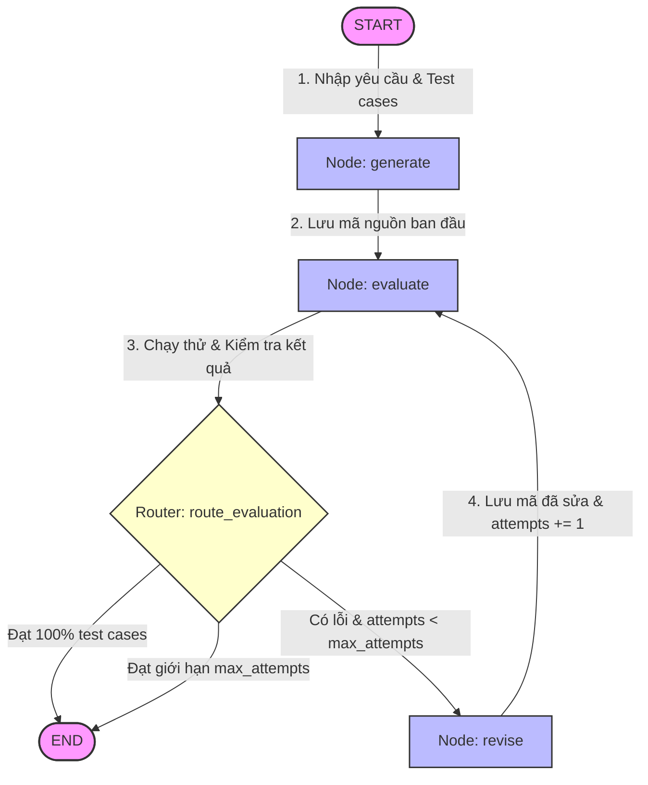

# Lab 04 · Cycles and Termination

> 🔄 Tìm hiểu cơ chế vòng lặp phản hồi (Feedback Loop/Cycles) và các điều kiện ngắt để ngăn ngừa vòng lặp vô hạn (Termination/Limits) trong LangGraph thông qua mô hình tự sửa lỗi code của AI.

## 🎯 Mục tiêu

- Hiểu cách xây dựng luồng đồ thị tuần hoàn (Cyclic Graphs) trong LangGraph.
- Phân biệt rõ sự khác nhau giữa **Business Limit** (`max_attempts` tự đếm trong State) và **System Limit** (`recursion_limit` của LangGraph).
- Quản lý và cập nhật trạng thái State một cách an toàn qua từng vòng lặp.
- Thực thi động mã Python bằng `exec()` và kiểm thử ngoại lệ runtime.

## 📂 Cấu trúc & Ý tưởng (AI Code Writer & Auto-Repair Agent)

Bài Lab này xây dựng một trợ lý lập trình có khả năng tự chạy thử và tự động sửa mã nguồn của chính mình:
- **`state.py`**: Định nghĩa `CodeWriterState` lưu trữ yêu cầu, test cases, mã nguồn Python hiện tại, feedback lỗi, biến đếm `attempts` và lý do dừng `stop_reason`.
- **`nodes/generate.py`**: Node sử dụng LLM để viết mã nguồn Python ban đầu dựa trên mô tả nhiệm vụ. Chứa hàm `clean_code()` lọc bỏ các thẻ markdown.
- **`nodes/evaluate.py`**: Trình chấm bài tự động. Chạy thực tế đoạn code bằng `exec()`, đối chiếu kết quả với test cases và bắt ngoại lệ nếu code bị crash.
- **`nodes/revise.py`**: Node sửa lỗi. Đọc mã nguồn bị lỗi và Stack Trace phản hồi từ evaluate để tự viết lại code sửa đổi, đồng thời tăng số lần attempts.
- **`routers.py`**: Định nghĩa hàm định tuyến `route_evaluation` điều hướng quay lại sửa code nếu sai và chưa quá số lần sửa tối đa.
- **`graph.py`**: Lắp ráp đồ thị tuần hoàn và biên dịch.
- **`run.py`**: Chạy thực nghiệm tự động hóa quá trình viết và tự sửa hàm kiểm tra chuỗi đối xứng (Palindrome).

## 🔄 Sơ đồ luồng hoạt động



## ⚙️ Hướng dẫn khởi chạy

Chạy kiểm thử tác vụ lập trình và tự sửa lỗi:
```bash
python -m labs.04_cycles_and_limits.run
```

Chạy bộ unit test tự động xác minh các điều kiện dừng (Success, Max attempts, Recursion limit):
```bash
python -m pytest labs/04_cycles_and_limits/tests -v
```
