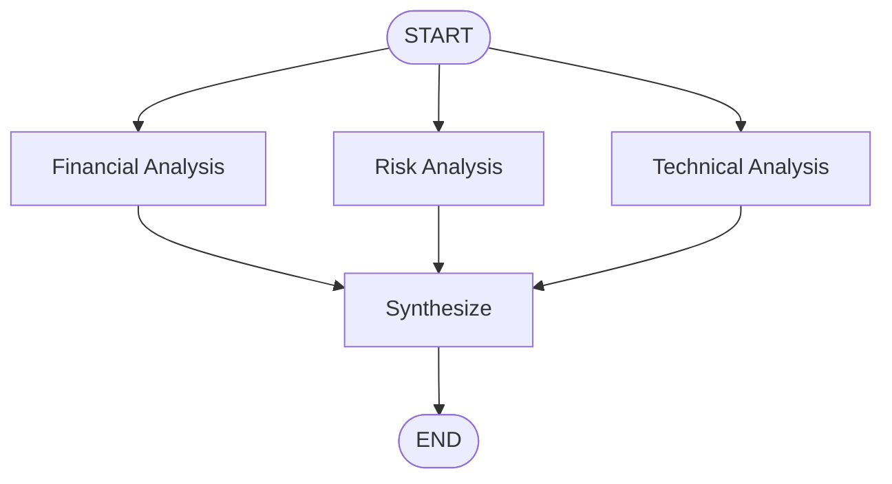

# Lab 05 · Parallel Execution & Reducer Merge

> ⚡ Chạy song song các Node độc lập (Fan-out) và gom kết quả về một Node chung (Fan-in) với Reducer.

## 🎯 Mục tiêu

- Hiểu mô hình Super-step khi xử lý nodes rẽ nhánh.
- Áp dụng `Annotated[list, operator.add]` tích lũy dữ liệu song song.
- Xây dựng luồng Fan-out / Fan-in thực tế (Phân tích cổ phiếu).
- So sánh tốc độ tuần tự vs song song.

## 🔄 Sơ đồ luồng



## 📂 Cấu trúc & Ý tưởng (Stock Analysis Pipeline)

- **`state.py`**: `AnalysisState` với reducer tích lũy kết quả phân tích.
- **`nodes/financial_analysis.py`**: Phân tích tài chính.
- **`nodes/risk_analysis.py`**: Phân tích rủi ro.
- **`nodes/technical_analysis.py`**: Phân tích kỹ thuật.
- **`nodes/synthesize.py`**: Tổng hợp kết quả từ 3 nhánh.
- **`graph.py`**: Đồ thị fan-out → fan-in.
- **`benchmarks.py`**: So sánh latency tuần tự vs song song.

## ⚙️ Hướng dẫn khởi chạy

```bash
python -m labs.05_parallel_execution.benchmarks
```

```bash
python -m pytest labs/05_parallel_execution/tests -v
```
