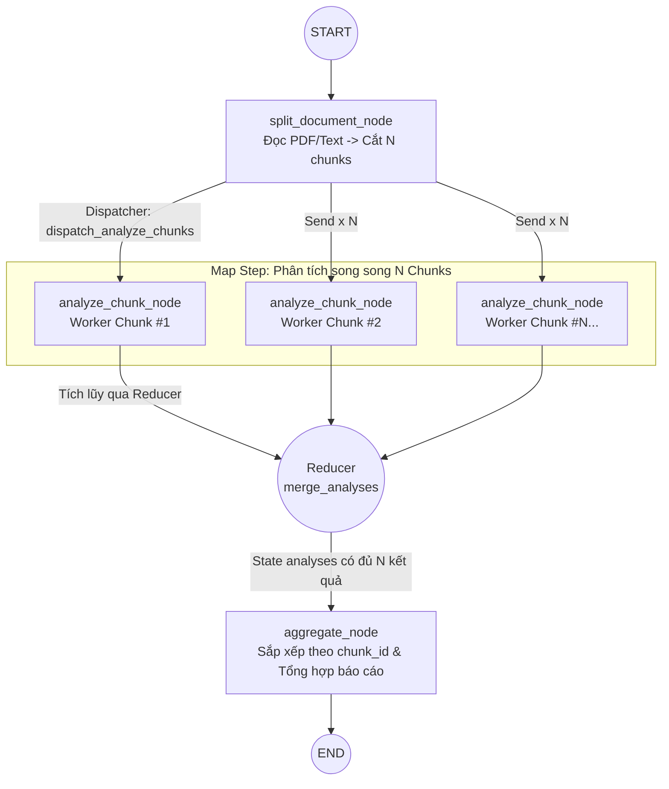

# Lab 06 · Send & Dynamic Map-Reduce

> 🗺️ Phân tích tài liệu với số lượng chunk động bằng đối tượng `Send` và cơ chế Map-Reduce trong LangGraph.

## 🎯 Mục tiêu

- Hiểu và áp dụng cơ chế rẽ nhánh động (Dynamic Fan-out) với đối tượng `Send`.
- Phân biệt giữa State toàn cục (`OverallState`) và State cục bộ từng Worker (`WorkerState`).
- Tích lũy kết quả từ nhiều worker song song bằng Reducer (`merge_analyses`).
- Tổng hợp (Reduce) và sắp xếp kết quả động từ các worker để tạo báo cáo hoàn chỉnh.

## 🔄 Sơ đồ Pipeline & Luồng thực thi



## 📂 Cấu trúc & Ý tưởng (Document Map-Reduce)

Bài Lab này giả lập quy trình xử lý tài liệu/hợp đồng dài theo mô hình Map-Reduce:
- **`state.py`**: Định nghĩa `OverallState` chứa `document_path`, `document`, `chunks`, `analyses` (dùng Reducer `merge_analyses`), và `final_report`.
- **`worker_state.py`**: Định nghĩa `WorkerState` chứa `chunk_id` và `chunk_text` nhỏ gọn cấp cho từng worker.
- **`reducers.py`**: Hàm `merge_analyses` tích lũy kết quả từ các worker.
- **`dispatchers.py`**: Hàm `dispatch_analyze_chunks` đếm $N$ chunks và tạo ra $N$ lệnh `Send("analyze_chunk", worker_state)`.
- **`nodes/split_document.py`**: Đọc file PDF/Text và cắt thành các chunks.
- **`nodes/analyze_chunk.py`**: Node Worker phân tích từng chunk bằng LLM.
- **`nodes/aggregate.py`**: Node tổng hợp sắp xếp lại các phân tích theo `chunk_id` và xuất `final_report`.
- **`graph.py`**: Dựng đồ thị `StateGraph` kết nối toàn bộ luồng.
- **`run.py`**: Script chạy thực nghiệm toàn bộ đồ thị từ A đến Z.

## ⚙️ Hướng dẫn khởi chạy

Chạy script thực thi toàn bộ đồ thị:
```powershell
$env:PYTHONPATH="."; python labs/06_send_map_reduce/run.py
```

Chạy bộ unit test tự động:
```powershell
$env:PYTHONPATH="."; pytest labs/06_send_map_reduce/tests
```
