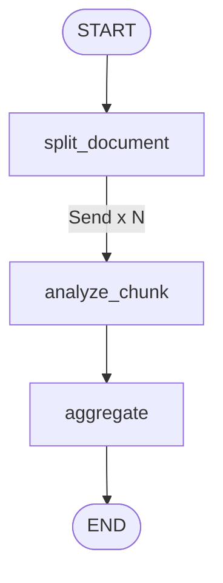

# Lab 06 · Send & Dynamic Map-Reduce

> 🗺️ Phân tích tài liệu với số lượng chunk động bằng `Send` và cơ chế Map-Reduce.

## 🎯 Mục tiêu

- Áp dụng rẽ nhánh động (Dynamic Fan-out) với `Send`.
- Phân biệt State toàn cục (`OverallState`) và State cục bộ (`WorkerState`).
- Tích lũy kết quả song song bằng Reducer (`merge_analyses`).
- Tổng hợp (Reduce) và sắp xếp kết quả từ các worker.

## 🔄 Sơ đồ luồng



## 📂 Cấu trúc & Ý tưởng (Document Map-Reduce)

- **`state.py`**: `OverallState` chứa `chunks`, `analyses` (Reducer), `final_report`.
- **`worker_state.py`**: `WorkerState` gọn nhẹ (`chunk_id`, `chunk_text`).
- **`reducers.py`**: `merge_analyses` tích lũy kết quả worker.
- **`dispatchers.py`**: `dispatch_analyze_chunks` tạo N lệnh `Send`.
- **`nodes/split_document.py`**: Đọc file và cắt thành chunks.
- **`nodes/analyze_chunk.py`**: Worker phân tích từng chunk bằng LLM.
- **`nodes/aggregate.py`**: Sắp xếp theo `chunk_id` và xuất `final_report`.
- **`graph.py`**: Đồ thị kết nối toàn bộ luồng.

## ⚙️ Hướng dẫn khởi chạy

```bash
python -m labs.06_send_map_reduce.run
```

```bash
python -m pytest labs/06_send_map_reduce/tests -v
```
