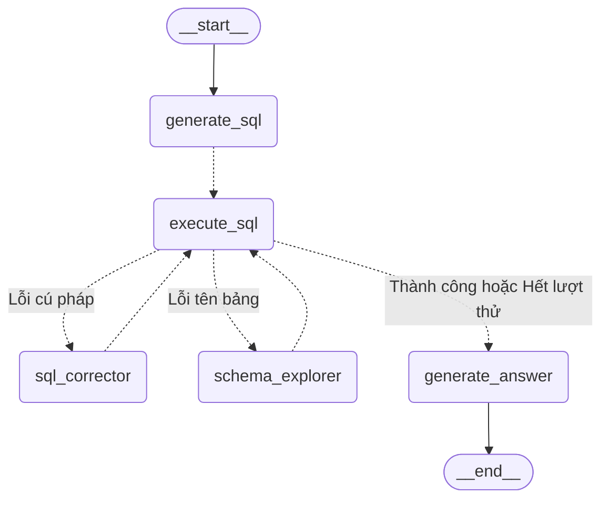

# Lab 07 — Command và Unified Control Flow (SQL Auto-Correction Agent)

## 🎯 Mục tiêu
Tìm hiểu cơ chế định tuyến động (Dynamic Routing) và cập nhật trạng thái kết hợp trong LangGraph sử dụng **`Command` API**. Thay vì xây dựng các cạnh điều kiện tĩnh (`add_conditional_edges`) phức tạp và làm phình to Graph State, `Command` cho phép chính các node tự quyết định:
1. **Dữ liệu cập nhật** vào State (`update`).
2. **Node tiếp theo** sẽ thực thi (`goto`).

---

## 🤖 Kịch bản bài toán: SQL Auto-Correction Agent
Hệ thống nhận vào một yêu cầu truy vấn bằng ngôn ngữ tự nhiên từ người dùng. Một pipeline tự động sửa lỗi truy vấn (Auto-Correction) được kích hoạt để đảm bảo SQL chạy thành công trên database SQLite in-memory:

1. **`generate_sql`**: Dịch yêu cầu tự nhiên thành SQL nháp (hoặc nhận trực tiếp SQL nháp từ Client).
2. **`execute_sql`**: Thực thi SQL nháp trên SQLite. Nếu gặp lỗi, nó sẽ tự động phân tích và bắt lỗi thông qua các đối tượng `Command`:
   - Lỗi cú pháp (Syntax error) $\rightarrow$ chuyển sang `sql_corrector`.
   - Lỗi sai tên bảng/cột (Schema reference error) $\rightarrow$ chuyển sang `schema_explorer`.
   - Thành công hoặc hết lượt sửa $\rightarrow$ chuyển sang `generate_answer`.
3. **`sql_corrector`**: Nhận diện lỗi ngữ pháp SQL và tự động viết lại đúng cú pháp, sau đó quay lại `execute_sql`.
4. **`schema_explorer`**: Đối chiếu lỗi thiếu bảng với **Schema Catalog** có sẵn để tìm tên bảng hợp lệ nhất, sửa SQL và quay lại `execute_sql`.
5. **`generate_answer`**: Node kết thúc, dịch kết quả database thô thành câu trả lời tự nhiên cho người dùng.

---

## 📊 Sơ đồ Pipeline điều phối bằng `Command`

Dưới đây là sơ đồ luồng đi của câu lệnh được mô hình hóa bằng Mermaid. Các đường nét đứt (`-.->`) thể hiện định tuyến động thông qua đối tượng `Command(goto=...)`:



---

## 📂 Hướng dẫn chạy thử nghiệm

### 1. Khởi tạo cơ sở dữ liệu mẫu (Seeding Database)
Nếu muốn chủ động khởi tạo hoặc reset dữ liệu mẫu vào file cơ sở dữ liệu vật lý `sqlite.db`:
```bash
python labs/07_command_control/database/build_db.py
```

### 2. Chạy thử nghiệm Đồ thị
Chạy file thử nghiệm chính để chạy đồ thị thông qua các kịch bản mẫu sửa lỗi:
```bash
# Chạy từ thư mục gốc của dự án
$env:PYTHONIOENCODING="utf-8"
python -m labs.07_command_control.run
```
