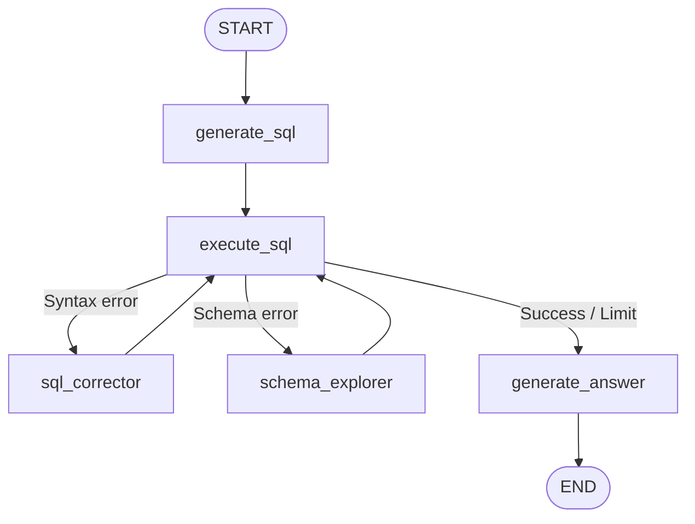

# Lab 07 · Command & Unified Control Flow

> 🎮 Định tuyến động và cập nhật State kết hợp bằng `Command` API — thay thế `add_conditional_edges` phức tạp.

## 🎯 Mục tiêu

- Sử dụng `Command(update=..., goto=...)` để node tự quyết định cập nhật State + chọn node tiếp theo.
- So sánh ưu nhược điểm giữa `Command` vs conditional edges truyền thống.
- Xây dựng vòng lặp tự sửa lỗi (auto-correction loop) điều phối bằng `Command`.

## 🔄 Sơ đồ luồng (SQL Auto-Correction Agent)



## 📂 Cấu trúc & Ý tưởng

- **`state.py`**: `SQLAgentState` chứa query, SQL, error info, attempt count.
- **`nodes/generate_sql.py`**: Dịch ngôn ngữ tự nhiên → SQL nháp.
- **`nodes/execute_sql.py`**: Chạy SQL trên SQLite, phân loại lỗi bằng `Command`.
- **`nodes/sql_corrector.py`**: Sửa lỗi cú pháp SQL.
- **`nodes/schema_explorer.py`**: Đối chiếu Schema Catalog, sửa tên bảng/cột.
- **`nodes/generate_answer.py`**: Dịch kết quả thô → câu trả lời tự nhiên.
- **`graph.py`**: Đồ thị điều phối hoàn toàn bằng `Command`.

## ⚙️ Hướng dẫn khởi chạy

```bash
python -m labs.07_command_control.run
```

```bash
python -m pytest labs/07_command_control/tests -v
```
