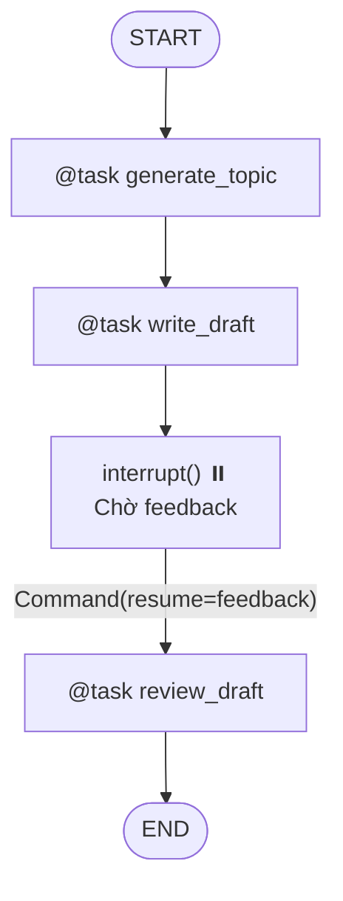

# Lab 08 · Functional API & Replay Cache

> 🧩 Xây dựng workflow dạng imperative bằng `@entrypoint` + `@task` thay vì vẽ StateGraph truyền thống. Tích hợp Replay Cache tự động lưu kết quả khi resume.

## 🎯 Mục tiêu

- Viết workflow tuần tự bằng Functional API (`@entrypoint`, `@task`).
- Tích hợp Human-in-the-loop với `interrupt()` + `Command(resume=...)`.
- Hiểu cơ chế Replay Cache: task đã chạy xong được lấy từ cache khi resume, không chạy lại.

## 🔄 Sơ đồ luồng



## 📂 Cấu trúc & Ý tưởng (Content Writing Workflow)

- **`tasks.py`**: 3 tasks: `generate_topic`, `write_draft`, `review_draft` — bọc bởi `@task`.
- **`workflow.py`**: Luồng chính với `@entrypoint`, gọi tasks tuần tự, ngắt giữa chừng.
- **`run.py`**: Script chạy demo kịch bản interrupt → resume.

## ⚙️ Hướng dẫn khởi chạy

```bash
python -m labs.08_functional_api.run
```

```bash
python -m pytest labs/08_functional_api/tests -v
```
