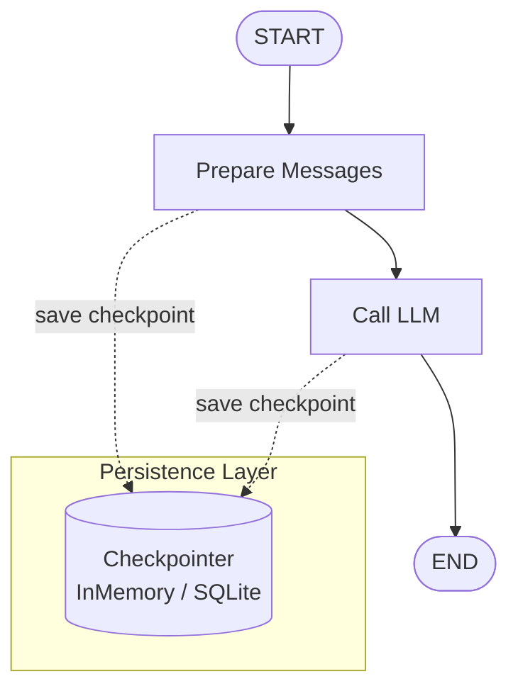

# Lab 09 · Persistence, Threads & Checkpoints

> 💾 Cấu hình lưu trữ trạng thái (Persistence) bằng Checkpointer, tính cô lập luồng (Thread Isolation) và truy vấn lịch sử checkpoint.

## 🎯 Mục tiêu

- Hiểu nguyên lý Checkpointer lưu/phục hồi State sau mỗi bước chạy.
- Phân biệt **InMemorySaver** (RAM, mất khi tắt) vs **SqliteSaver** (bền vững).
- Kiểm chứng Thread Isolation giữa các `thread_id` khác nhau.
- Sử dụng `get_state` và `get_state_history` truy vấn checkpoint.

## 🔄 Sơ đồ luồng



## 📂 Cấu trúc & Ý tưởng (Conversation Chatbot)

- **`state.py`**: `ChatState` với `messages` dùng `add_messages` reducer.
- **`nodes.py`**: Chuyển query thành message và gọi LLM.
- **`graph.py`**: Đồ thị hội thoại với checkpointer.
- **`persistence/memory.py`**: Demo `InMemorySaver` + thread isolation.
- **`persistence/sqlite.py`**: Demo `SqliteSaver` — nhớ tên qua nhiều phiên.
- **`inspect_state.py`**: Truy vấn checkpoint hiện tại.
- **`inspect_history.py`**: Truy vấn toàn bộ lịch sử checkpoint.

## ⚙️ Hướng dẫn khởi chạy

```bash
python -m labs.09_persistence_threads.persistence.memory
python -m labs.09_persistence_threads.persistence.sqlite
python -m labs.09_persistence_threads.inspect_state
python -m labs.09_persistence_threads.inspect_history
```

```bash
python -m pytest labs/09_persistence_threads/tests -v
```
