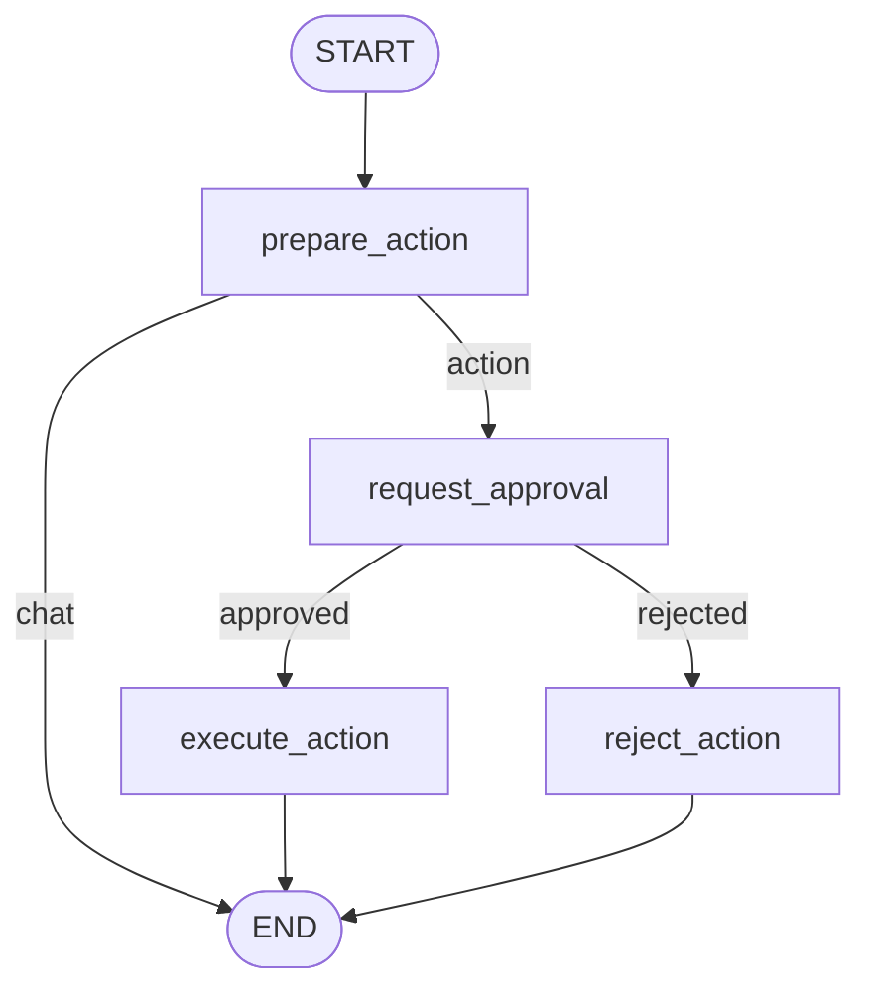

# Lab 10 · Human-in-the-loop — Interrupt & Approval

> 🛑 Xây dựng luồng phê duyệt con người trước khi thực thi hành động nhạy cảm. Sử dụng `interrupt()` để dừng đồ thị và `Command(resume=...)` để Client truyền quyết định phê duyệt.

## 🎯 Mục tiêu

- Hiểu mô hình HITL và tầm quan trọng với hành động nhạy cảm (chuyển tiền, gửi email).
- Sử dụng `interrupt(payload)` dừng đồ thị, lưu checkpoint, trả payload về Client.
- Dùng `Command(resume=val)` để Client đánh thức đồ thị chạy tiếp.
- Thiết kế rẽ nhánh có điều kiện dựa trên trạng thái phê duyệt.

## 🔄 Sơ đồ luồng



## 📂 Cấu trúc & Ý tưởng (Action Approval Agent)

- **`state.py`**: `ApprovalState` (messages, action, approval_status).
- **`nodes/prepare_action.py`**: LLM phân loại chat thường ↔ hành động nhạy cảm.
- **`nodes/request_approval.py`**: Gọi `interrupt()` → chờ phê duyệt.
- **`nodes/execute_action.py`**: Thực thi nếu approved.
- **`nodes/reject_action.py`**: Từ chối kèm lý do.
- **`routers.py`**: Rẽ nhánh theo `approval_status`.
- **`graph.py`**: Đồ thị + checkpointer.
- **`cli_approval.py`**: CLI tương tác demo.

## ⚙️ Hướng dẫn khởi chạy

```bash
python -m labs.10_interrupt_approval.cli_approval
```

| Kịch bản | Input mẫu | Kỳ vọng |
| :--- | :--- | :--- |
| Chat thường | `"hi"` | Trả lời LLM, không interrupt |
| Duyệt ✅ | `"chuyển 5 triệu cho Tú"` → `y` | Interrupt → approve → execute |
| Từ chối ❌ | `"gửi email cho CEO"` → `n` | Interrupt → reject kèm lý do |

```bash
python -m pytest labs/10_interrupt_approval/tests -v
```
