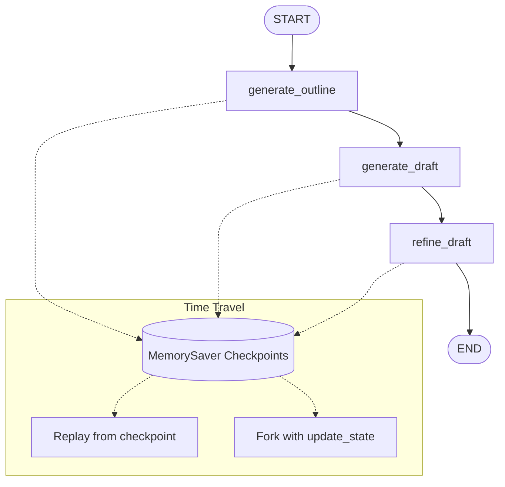

# Lab 11 · Time Travel — Replay & Fork Checkpoints

> Khám phá cơ chế Time Travel trong LangGraph: lưu checkpoint sau từng bước, xem lại lịch sử chạy, replay từ một checkpoint cũ và tạo nhánh mới bằng cách cập nhật state tại checkpoint đó.

## Mục tiêu

- Hiểu cách `MemorySaver` lưu state theo `thread_id`.
- Sử dụng `get_state_history` để đọc lại lịch sử checkpoint.
- Replay graph từ một checkpoint đã có bằng `app.invoke(None, checkpoint_config)`.
- Tạo nhánh mới bằng `update_state` và tiếp tục chạy từ nhánh đó.
- So sánh kết quả giữa luồng gốc và các nhánh được fork.

## Sơ đồ luồng



## Cấu trúc & Ý tưởng (Writer Graph)

- **`state.py`**: Định nghĩa `WriterState` gồm `query`, `topic`, `outline`, `draft`, `final_text`.
- **`nodes/generate_outline.py`**: Xác định chủ đề và tạo dàn ý ngắn gọn.
- **`nodes/generate_draft.py`**: Viết bản nháp từ chủ đề và dàn ý.
- **`nodes/refine_draft.py`**: Biên tập bản nháp thành văn bản hoàn chỉnh.
- **`graph.py`**: Tạo graph tuần tự và gắn `MemorySaver` làm checkpointer.
- **`replay.py`**: Chạy graph, lấy checkpoint trước `generate_draft`, rồi replay từ checkpoint đó.
- **`fork.py`**: Cập nhật `outline` tại checkpoint cũ để tạo một nhánh mới.
- **`compare_branches.py`**: Tạo nhiều nhánh từ cùng checkpoint và so sánh kết quả.

## Hướng dẫn khởi chạy

Chạy graph chính:

```bash
python -m labs.11_time_travel.graph
```

Replay từ checkpoint:

```bash
python -m labs.11_time_travel.replay
```

Fork một nhánh mới:

```bash
python -m labs.11_time_travel.fork
```

So sánh nhiều nhánh:

```bash
python -m labs.11_time_travel.compare_branches
```

Chạy test:

```bash
python -m pytest labs/11_time_travel/tests -v
```

## Ghi chú

- Các demo dùng cùng `thread_id` để minh họa lịch sử checkpoint trong một phiên chạy.
- `MemorySaver` chỉ lưu trong bộ nhớ, dữ liệu sẽ mất khi tiến trình kết thúc.
- Các node có gọi LLM, vì vậy cần cấu hình API key phù hợp trong môi trường trước khi chạy demo.
