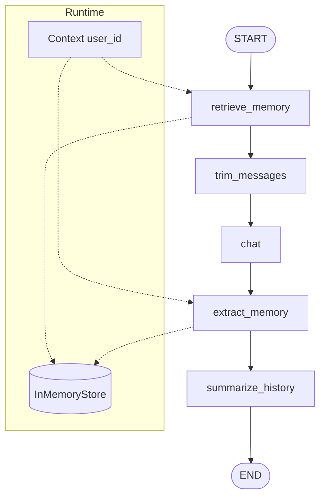

# Lab 12 · Short-term & Long-term Memory

> Xây dựng chatbot có bộ nhớ ngắn hạn từ lịch sử hội thoại và bộ nhớ dài hạn qua `InMemoryStore`. Lab này minh họa cách dùng `add_messages`, `runtime.context`, `runtime.store` và namespace để tách memory theo từng user.

## Mục tiêu

- Dùng `add_messages` để tự động cộng dồn lịch sử hội thoại trong state.
- Tách short-term memory thành `recent_messages` trước khi gọi LLM.
- Dùng `runtime.store` để đọc và ghi long-term memory.
- Dùng `Context(user_id)` để phân tách memory giữa các user.
- Trích xuất thông tin đáng nhớ sau mỗi lượt chat và lưu lại theo namespace.

## Sơ đồ luồng



## Cấu trúc & Ý tưởng (Memory Chatbot)

- **`state.py`**: Định nghĩa `State` gồm `query`, `answer`, `messages`, `retrieved_memories`, `recent_messages`, `summary`.
- **`context.py`**: Định nghĩa `Context` với `user_id` để runtime biết phiên đang chạy cho user nào.
- **`graph.py`**: Khai báo graph, gắn `MemorySaver` làm checkpointer và `InMemoryStore` làm store dùng chung.
- **`nodes/retrieve_memory.py`**: Đọc long-term memory từ `runtime.store` theo namespace `("memories", user_id)`.
- **`nodes/trim_messages.py`**: Chuyển các message gần nhất thành `recent_messages` để prompt gọn hơn.
- **`nodes/chat.py`**: Gọi LLM bằng câu hỏi hiện tại, memory dài hạn và lịch sử gần đây.
- **`nodes/extract_memory.py`**: Kiểm tra câu trả lời có thông tin đáng lưu không, rồi ghi vào `runtime.store`.
- **`nodes/summarize_history.py`**: Tóm tắt lịch sử hội thoại khi cần dùng làm context bổ sung.

## Runtime, Store & Namespace

- `runtime.context` chứa cấu hình phiên chạy, ví dụ `user_id`.
- `runtime.store` là nơi lưu và đọc long-term memory.
- `namespace = ("memories", user_id)` giúp memory của từng user không bị lẫn nhau.
- Không khai báo `InMemoryStore()` riêng trong từng node; store được inject từ `graph.py`.

Ví dụ tư duy trong node:

```python
user_id = runtime.context.user_id
store = runtime.store
namespace = ("memories", user_id)
```

## Hướng dẫn khởi chạy

Cài dependency nếu môi trường chưa có LangGraph:

```bash
pip install -r requirements.txt
```

Kiểm tra graph compile:

```bash
python -m labs.12_short_long_memory.graph
```

Chạy test:

```bash
python -m pytest labs/12_short_long_memory/tests -v
```

## Ghi chú

- `InMemoryStore` chỉ lưu trong bộ nhớ, dữ liệu sẽ mất khi tiến trình kết thúc.
- Các node có gọi LLM, vì vậy cần cấu hình API key phù hợp trước khi chạy full workflow.
- `messages` nên giữ dạng `BaseMessage`; không ghi đè field này bằng string.
- `recent_messages` là bản text rút gọn để đưa vào prompt, không thay thế lịch sử gốc.
