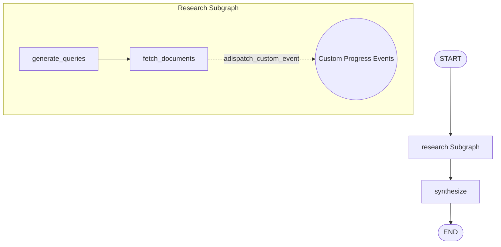

# Lab 13 · Streaming Events & Real-time Progress

> 🌊 Truyền phát sự kiện thời gian thực (Streaming): từ `astream` (`updates`, `values`, `messages`), `astream_events` (v2), custom channels đến phát sự kiện tiến trình tùy chỉnh (`adispatch_custom_event`).

## 🎯 Mục tiêu

- Phân biệt các chế độ stream nâng cao trong LangGraph (`updates`, `values`, `messages`).
- Lắng nghe và xử lý sự kiện chi tiết của đồ thị bằng `astream_events` (v2 API).
- Tự định nghĩa Custom Channel và Reducer quản lý tiến trình (`ProgressUpdate`, `progress_reducer`).
- Bắn sự kiện tiến trình thời gian thực từ các Node/Tool bằng `adispatch_custom_event`.
- Xây dựng Consumer phân loại đa dạng sự kiện (token LLM, tool start/end, node start/end, custom progress).

## 🔄 Sơ đồ luồng



## 📂 Cấu trúc & Ý tưởng (AI Research Assistant with Progress Streaming)

- **`state.py`**: Định nghĩa `ResearchSubgraphState` và `ParentState` tích hợp Custom Channel `progress`.
- **`custom_channels.py`**: Định nghĩa kiểu `ProgressUpdate` và reducer `progress_reducer` cập nhật phần trăm tiến trình.
- **`nodes.py`**:
  - `web_search`: Async tool tìm kiếm thông tin bằng Tavily (có cơ chế Fallback).
  - `generate_queries_node`: Tự động sinh danh sách truy vấn nghiên cứu.
  - `fetch_documents_node`: Lấy tài liệu từ web search và phát sự kiện tiến trình `progress` theo thời gian thực.
  - `synthesize_node`: Sử dụng LLM tổng hợp báo cáo và phát mốc tiến trình hoàn tất.
- **`graph.py`**: Xây dựng đồ thị phân cấp kết hợp Subgraph và `MemorySaver` checkpointer.
- **`event_consumer.py`**: Async generator `consume_events` nhận dạng các sự kiện từ `astream_events` (token, tool, node, custom progress).
- **`stream_console.py`**: Console demo trực quan 4 chế độ stream: `updates`, `values`, `messages` và `events`.
- **`tests/`**:
  - `test_update_stream.py`: Kiểm thử `stream_mode="updates"` và `stream_mode="values"`.
  - `test_message_stream.py`: Kiểm thử `stream_mode="messages"`.
  - `test_custom_progress.py`: Kiểm thử bắn và lắng nghe `custom_event` qua `astream_events`.

## ⚙️ Hướng dẫn khởi chạy

```bash
python -m labs.13_streaming_events.stream_console
```

```bash
python -m pytest labs/13_streaming_events/tests -v
```
