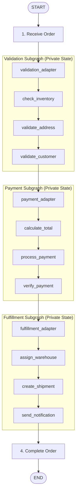

# Lab 15 · Subgraphs & Modular Pipeline Architecture

> 📦 Xây dựng kiến trúc đồ thị phân cấp (**Hierarchical Subgraphs**) ứng dụng trong bài toán thực tế **E-Commerce Order Processing Pipeline**. Lab này minh họa cách đóng gói trạng thái riêng tư (**Private State & Information Hiding**), cơ chế chuyển đổi dữ liệu qua **Adapter Pattern**, và phân tách hệ thống thành các Subgraph nghiệp vụ độc lập.

---

## 🎯 Mục tiêu bài học

- Hiểu rõ bản chất và sự cần thiết của **Subgraph** trong các hệ thống Agent phức tạp: tránh làm ô nhiễm (`pollute`) Parent State, tăng tính module hóa và dễ bảo trì.
- Nắm vững **2 phương pháp tích hợp Subgraph**:
  1. **Direct Integration (Shared State)**: Nhúng trực tiếp khi chung schema.
  2. **Adapter Pattern (Private State)**: Chuyển đổi dữ liệu 2 chiều khi schema khác biệt, bảo vệ dữ liệu nhạy cảm (như `card_token`, `stock_levels`).
- Thực hành quản lý trạng thái riêng tư cho 3 Subgraph nghiệp vụ chuyên biệt:
  - **`Validation Subgraph`**: Kiểm tra tồn kho, xác thực địa chỉ và kiểm tra trạng thái khách hàng.
  - **`Payment Subgraph`**: Tính tổng tiền đơn hàng, áp dụng ưu đãi VIP, token hóa thẻ và xác thực giao dịch qua Payment Gateway.
  - **`Fulfillment Subgraph`**: Phân phối kho hàng, chọn đơn vị vận chuyển tối ưu (`carriers`), tạo mã vận đơn (`tracking_id`), ước tính ngày giao và gửi email thông báo.
- Streaming tiến trình thực thi thời gian thực của từng node bên trong Subgraph.

---

## 🔄 Sơ đồ luồng toàn hệ thống (Architecture Flow)



---

## 📂 Cấu trúc thư mục

```text
labs/15_subgraphs/
├── README.md                          # Tài liệu hướng dẫn chi tiết
├── data/
│   ├── data.py                        # Loader nạp dữ liệu từ các file JSON
│   ├── customers.json                 # Danh sách khách hàng & trạng thái VIP
│   ├── inventory.json                 # Dữ liệu tồn kho & kho lưu trữ
│   ├── orders.json                    # Danh sách đơn hàng mẫu kiểm thử
│   └── warehouses.json                # Thông tin kho hàng & đơn vị vận chuyển
├── subgraphs/
│   ├── validation/                    # Subgraph 1: Xác thực đơn hàng
│   │   ├── state.py                   # ValidationState (stock_levels, address_valid, ...)
│   │   ├── nodes.py                   # check_inventory, validate_address, validate_customer
│   │   └── graph.py                   # Compiled validation_subgraph
│   ├── payment/                       # Subgraph 2: Xử lý thanh toán
│   │   ├── state.py                   # PaymentState (card_token, gateway_response, ...)
│   │   ├── nodes.py                   # calculate_node, process_payment, verify_payment
│   │   └── graph.py                   # Compiled payment_subgraph
│   └── fulfillment/                   # Subgraph 3: Giao hàng & Vận đơn
│       ├── state.py                   # FulfillmentState (warehouse_id, carriers, tracking_id)
│       ├── nodes.py                   # assign_warehouse, create_shipment, send_notification
│       └── graph.py                   # Compiled fulfillment_subgraph
├── adapters/                          # Lớp chuyển đổi dữ liệu (ParentState <-> SubgraphState)
│   ├── validation_adapter.py          # Wrapper gọi validation_subgraph
│   ├── payment_adapter.py             # Wrapper gọi payment_subgraph
│   └── fulfillment_adapter.py         # Wrapper gọi fulfillment_subgraph
├── parent/
│   ├── state.py                       # ParentState (thông tin đơn, kết quả tổng hợp, logs)
│   ├── nodes.py                       # receive_order, compile_result
│   └── graph.py                       # Đồ thị cha kết nối toàn bộ pipeline
└── tests/                             # Bộ kiểm thử tự động
    ├── test_shared_schema.py          # Kiểm thử mô hình dùng chung State
    ├── test_private_schema.py         # Kiểm thử mô hình cô lập State qua Adapter
    └── test_subgraph_persistence.py   # Kiểm thử Checkpointer và Inspect Nested State
```

---

## ⚙️ Hướng dẫn chạy thử nghiệm

### 1. Chạy thử nghiệm từng Subgraph độc lập

Mỗi Subgraph được thiết kế hoàn toàn độc lập, có thể test riêng biệt:

* **Test Validation Subgraph:**
  ```bash
  python -m labs.15_subgraphs.subgraphs.validation.graph
  ```

* **Test Payment Subgraph:**
  ```bash
  python -m labs.15_subgraphs.subgraphs.payment.graph
  ```

* **Test Fulfillment Subgraph:**
  ```bash
  python -m labs.15_subgraphs.subgraphs.fulfillment.graph
  ```

### 2. Chạy toàn bộ quy trình xử lý đơn hàng (Parent Pipeline)

```bash
python -m labs.15_subgraphs.parent.graph
```

### 3. Chạy bộ Test Suite với pytest

```bash
python -m pytest labs/15_subgraphs/tests -v
```
